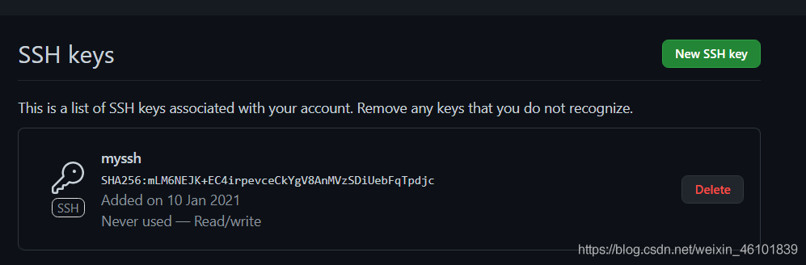
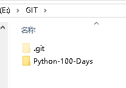
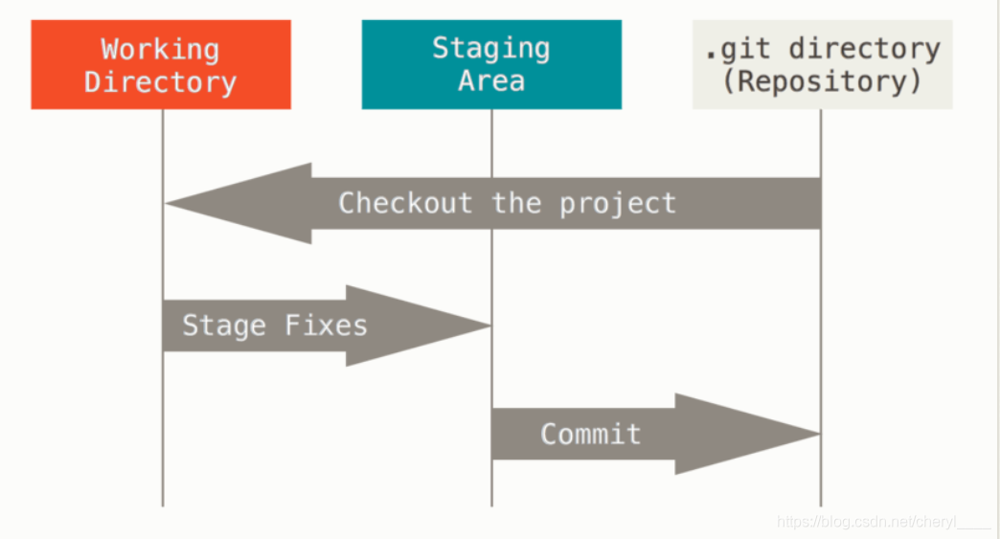
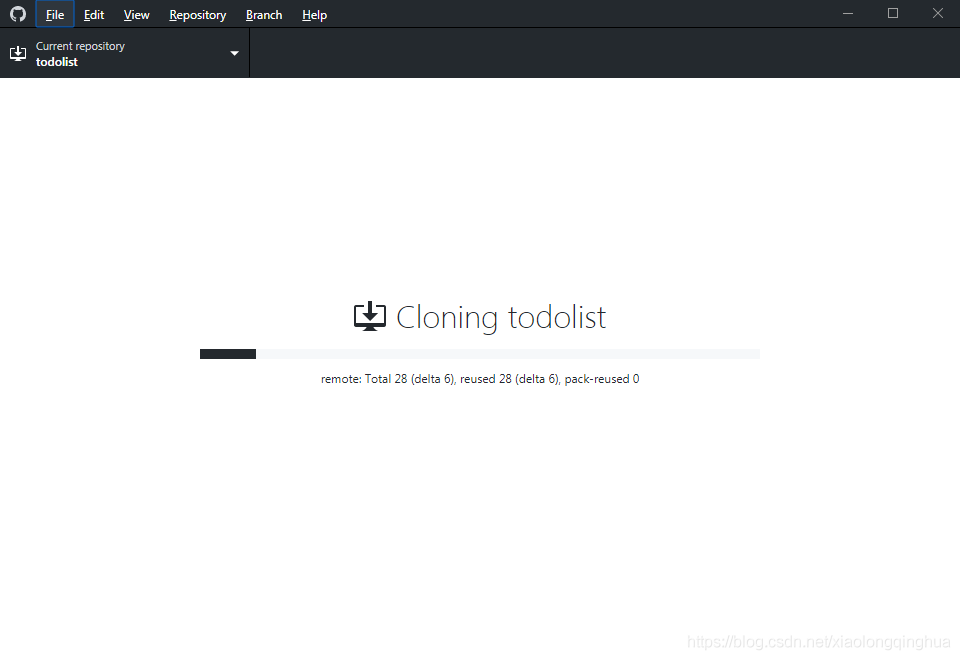

## Python selenium 使用Chrome 禁止弹出保存密码弹窗

```python
chrome_option=webdriver.ChromeOptions()

#禁用“保存密码”弹出窗口
chrome_option.add_experimental_option("prefs",{"credentials_enable_service":False,"profile.password_manager_enabled":False})

driver=webdriver.Chrome(options=chrome_option)
```

其它常用的配置：

```python
#禁止显示“请停用以开发者……”
chrome_option.add_experimental_option('useAutomationExtension',False)

#禁止显示“Chrome正受到自动化软件的控制”
chrome_option.add_experimental_option("excludeSwitches",['enable-automation'])

chrome_option.add_experimental_option('w3c',False)

#无头模式
chrome_option.add_argument('--headless')
```


## webdriver 中使用JavaScript

https://blog.csdn.net/weixin_34379088/article/details/117865984

给js传递参数

所传递的参数就是script执行时需要的参数，调用格式为

execute_script(script,参数1，参数2，参数3,…)

如

\#实现给指定元素value赋新值

ele=driver.find_element_by_id('UserName')

printele

js="arguments[0].value=arguments[1]"printdriver.execute_script(js,ele,"100000000") #ele就是第一个参数，js执行代码中用arguments[0]引用ele，“10000000”就是第二个参数，代码中用arguments[1]引用


## selenium+python 对输入框的输入处理方法    向input传数据失败

最近自己在做项目的自动化测试（公司无此要求），在用户管理模块做修改用户信息时，脚本已经跑成功，并且的确做了update操作，但是自己登陆页面检查，信息却没有被修改，再次确定系统该模块的编辑功能可用，脚本如下：

```python
if result_num>1:   
print "Begin to change user infomations"   
driver.find_element_by_xpath("//*[@id='tbodyUserInfo']/tr/td[8]/img[2]").click()   
driver.implicitly_wait(15)   
driver.find_element_by_id("uname").clear()   
driver.find_element_by_id("uname").send_keys("MoondyLi")   
driver.find_element_by_id("truename").clear()   
driver.find_element_by_id("truename").send_keys("chenchen")   
driver.find_element_by_id("updateUser").click()
```

怎么看，都觉得脚本没有问题，并且截图后，的确做了输入操作，后来使用Firefox自带的selenium IDE录了一遍该过程后，发现工具录制的自动化脚本多了一步：      

driver.find_element_by_id("uname").click() 

\#先点击输入文本的输入框 

加上此步骤后，脚本成功的修改数据。


## Pycharm格式化代码快捷键

快捷键:*Ctrl + Alt + L* 可以将代码格式工整化


## selenium中使用JS语句

方式一：

```python
    ele = driver.find_element(By.XPATH, "//*[@id='F_Year']/div")
    year = "2023"
    driver.execute_script("arguments[0].innerText=arguments[1]", ele, year)
```

方式二：

```python
# 如果div有id根据id来定位
driver.execute_script("document.getElementById('home-pop').style.display='none'")

# 如果div没有id根据className来定位 请注意获取到的是一个数组
driver.execute_script("document.getElementsByClassName('home-pop')[0].style.display='none'")
```


## Selenium关于滚动条的处理

1.普通滚动条的处理，例如百度首页检索后的滚动条

```python
from selenium import webdriver
from time import sleep
from selenium.webdriver.common.by import By
driver = webdriver.Chrome()
driver.get('https://www.baidu.com')
driver.maximize_window()
sleep(5)
driver.find_element(By.ID, 'kw').send_keys('python')
driver.find_element(By.ID, 'su').click()
sleep(10)
js="var q=document.documentElement.scrollTop=5000" 
driver.execute_script(js)
```

2.对于iframe中的滚动条

首先要进入iframe内，然后在进行使用driver.execute_script()，具体方法同上，只是在执行execute_script方法前先执行driver.switch_to.frame()

3.对于一些自适应的数据滚动条。

有些数据并不是网页自带的滚动条，而是数据超过页面最大显示数量，所通过前端处理生成的滚动条，并且这些数据是只有当前页的数据才能通过selenium定位到，此刻需要定位到某个具体的元素，先进行跳转，然后在进行等待刷新，在进行捕捉数据。

```python
ele = driver.find_element(By.ID, 'vW1vR')     # vW1vR是当页最后一行的元素的ID
js4 = "arguments[0].scrollIntoView();"
driver.execute_script(js4, ele)
```

举个例子，网站有50条数据，但是页面只能显示10条，并且通过selenium去获取元素拿值得时候，发现只能拿到当前页面显示得十条数据，剩下得五十条数据，必须通过向下滚动，页面显示出来得时候才能捕捉到，此刻就需要使用到上面得方法。


## Python获取与处理文件路径/目录路径

https://blog.csdn.net/qq_45899597/article/details/128416394

文件目录结构说明

 

一、路径获取
1.1 获取当前文件的绝对路径
使用**os.path.abspath()**获取当前文件的绝对路径。

```python
import os
file_path = os.path.abspath(__file__)
print(file_path)

输出：
e:\Python\Path\python_path_test.py
```

1.2.1 获取当前文件的所在目录

```python
使用**os.path.dirname()**获取当前文件的所在目录。

import os
directory_path = os.path.dirname(os.path.abspath(__file__))
print(directory_path)

输出：
e:\Python\Path
```


1.2.2 获取当前文件的所在目录的上一级目录
使用多个**os.path.dirname()**嵌套以获取当前文件的所在目录的上一级目录。

```python
import os
parent_directory_path = os.path.dirname(os.path.dirname(os.path.abspath(__file__)))
print(parent_directory_path)

输出：
e:\Python
```


1.3 获取当前文件名
使用**os.path.basename()**获取当前文件的所在目录。

```python
import os
file_name = os.path.basename(__file__)
print(file_name)

输出：
python_path_test.py
```

1.4 获取当前文件对于基准路径的相对路径
使用**os.path.relpath(file_path, base_path)**获取当前文件对于基准路径的相对路径。

```python
import os
file_path = os.path.abspath(__file__) #获取当前文件的绝对路径
base_path = "E:\Python" #设置基准路径（计算相对路径的起始路径）
relative_path = os.path.relpath(file_path, base_path) #计算从基准路径开始的相对路径
print("Absolute Path: " + file_path)
print("Base Path: " + base_path)
print("Relative Path: " + relative_path)

输出：
Absolute Path: e:\Python\Path\python_path_test.py
Base Path: E:\Python
Relative Path: Path\python_path_test.py
```

二、路径判断
2.1 判断路径是否存在
使用**os.path.exists()**判断路径是否存在。

```python
import os
path = "./data/data_file.txt"
is_exists = os.path.exists(path)
print(is_exists)

输出：
True

import os
path = "./data/data.txt"
is_exists = os.path.exists(path)
print(is_exists)

输出：
False
```

 

2.2 判断路径是否为绝对路径
使用**os.path.isabs()**判断路径是否为绝对路径。

```python
import os
path = "E:\Python\Path\data\data_file.txt"
is_exists = os.path.isabs(path)
print(is_exists)

输出：
True

import os
path = "./data/data_file.txt"
is_exists = os.path.isabs(path)
print(is_exists)

输出：
False
```

 

2.3 判断路径是否为目录
使用**os.path.isdir()**判断路径是否为目录。

```python
import os
path = "E:\Python\Path\data"
is_exists = os.path.isdir(path)
print(is_exists)

输出：
True
```


```python
import os
path = "E:\Python\Path\data\data_file.txt"
is_exists = os.path.isdir(path)
print(is_exists)

输出：
False
```

2.4 判断路径是否为文件
使用**os.path.isfile()**判断路径是否为文件。

```python
import os
path = "E:\Python\Path\data\data_file.txt"
is_exists = os.path.isfile(path)
print(is_exists)

输出：
True
```


```python
import os
path = "E:\Python\Path\data"
is_exists = os.path.isfile(path)
print(is_exists)

输出：
False
```

三、路径处理
3.1 把多个目录/文件名合并(连接)为一个路径
使用**os.path.join(path1, path2, ···)**把多个目录/文件名合并(连接)为一个路径。

```python
import os
path1 = "E:\Python"
path2 = "Path\data"
path3 = "data_file.txt"
path = os.path.join(path1, path2, path3)
print(path)

输出：

E:\Python\Path\data\data_file.txt
```


3.2 把路径分割为文件所在目录路径(dirname)和文件名(basename)
使用**os.path.split()**把路径分割为文件所在目录路径(dirname)和文件名(basename)。

```python
import os
path = os.path.abspath(__file__)
result = os.path.split(path)
print(result)

输出：
('e:\\Python\\Path', 'python_path_test.py')
```

3.3 把路径分割为驱动器名（Windows操作系统）和文件路径
使用**os.path.splitdrive()**把路径分割为驱动器名(Windows)和文件路径。

```python
import os
path = os.path.abspath(__file__)
result = os.path.splitdrive(path)
print(result)

输出：
('e:', '\\Python\\Path\\python_path_test.py')
```


3.4 把路径分割为文件路径和文件扩展名
使用**os.path.splitext()**把路径分割为文件路径和文件扩展名。

```py
import os
path = os.path.abspath(__file__)
result = os.path.splitext(path)
print(result)
输出：
('e:\\Python\\Path\\python_path_test', '.py')
```


## Python打开Excel并读取，关闭Excel后提示(xlrd 有坑须注意)

https://blog.csdn.net/m0_37390678/article/details/126253502

关键词：Python、Open Excel、Close Excel

做为一名软件工程师，经常需要从各种各样的表中读取所需要的数据，最常用的数据来源就是Excel电子表格，有时修改读写Excel会出现莫名的错误。

需求：
    从网页上下载不同时间段的excel文件并读取后并删除Excel文件，重复执行：下载->读取->删除

问题：
    正常下载文件后能正常读取，读完数据后执行了关闭excel操作，但删除时提示“Python正在使用此文件”。

解决：
xlrd 库是有两个版本，一个仅支持.xls, 另一个仅支持 .xlsx

**打开.xlsx Excel文件**

```python
filePathName =r"d:\demo.xlsx"
Excelbook= xlrdm.open_workbook(filePathName)
sheet = Excelbook.sheet_by_index(0) #  0表示每1个sheet
sheet = Excelbook.sheet_by_name("sheet1") #  0表示每1个sheet
```

备注：获取sheet的方法。
1、通过sheets()方法获取，名称为sheet1的表获取方式是：sheets()[0]。
2、通过sheet名称获取，名称为sheet1的表获取方式是：sheet_by_name(‘sheet1’)。
3、通过sheet索引获取，名称为sheet1的表获取方式是：sheet_by_index(0)。


 

 

常用的读取excel表格的方法：
nrows：获取行数；
ncols：获取总列数；
row_values(行数)：获取一行的值；
col_values(列数)：获取一列的值；
cell_value(行数，列数)：获取单元格的值；
cell(行数, 列数).value：获取单元格的值。


```python
import xlrd3               # 支持 主要支持 .xls ，不能正常关闭Excel
Excelbook.release_resources()  # 关闭Excel时，无效

import xlrd                # 支持 .xlsx ，可以正常关闭Excel
Excelbook.release_resources()  # 关闭Excel  ，有效
```

**使用时需要注意，Execl版本的区别**

```python
import xlrd   # 支持 .xlsx ，可以正常关闭Excel
```

**打开.xlsx Excel文件**

```python
filePathName =r"d:\demo.xlsx"
Excelbook= xlrdm.open_workbook(filePathName)
sheet = Excelbook.sheet_by_index(0) #  0表示每1个sheet
sheet = Excelbook.sheet_by_name("sheet1") #  0表示每1个sheet
```

**获取工作簿所有sheet表对象名称**

```python
sheets_name = chart.sheet_names()
print(sheets_name)
for i in range(0,sheet.nrows): # 按列读取  range(1, sheet.ncols) # 按行读取
    record = sheet.row_values(i)  # 读取行
    统计项 =record[0]
    占比 =record[1]
    tgi =record[2]
print(f{统计项} {占比} {tgi})
Excelbook.release_resources()  # 关闭Excel
```


## 格式化字符串

原文链接：https://blog.csdn.net/zjbyough/article/details/96466658

**f-string**

f-string是2015年python 3.6 根据PEP 498新添加的一种字符串格式化方法，f-string实际上是在运行时计算的表达式，而不是常量值。在Python源代码中，f-string是一个文字字符串，前缀为’f’，其中包含大括号内的表达式。表达式会将大括号中的内容替换为其值。例如

```python
import datetime
name = "zings"
age = 17
date = datetime.date(2019,7,18)
print(f'my name is {name}, this year is {date:%Y},Next year, I\'m {age+1}')  # my name is zings, this year is 2019,Next year, I'm 18
```

## Git官网下载太慢解决方法

https://blog.51cto.com/u_15405812/5833132

问题描述:官网下载Git(Git-2.25.0-64-bit时,44.3M),需要下载10几个小时时，速度几乎是超不过20KB/s，用Fixfox浏览器下载(最快10KB/s),Free Download Manager 5(最快28KB/s),迅雷X(最快29KB/s)都试过,速度都很慢

 **解决办法**:

法一:GitHub地址： https://github.com/git-for-windows/git/releases/

法二:淘宝镜像下载git-for-windows Mirror: https://npm.taobao.org/mirrors/git-for-windows/						*Leonas：实测好用*

法三:新云软件园: https://www.newasp.net/soft/431610.html,选择"普通下载"

**注意事项:不同操作系统选择不同的版本,一定要下载和自己电脑配套的版本,我的是windows 10 x64**

## Git的安装和配置

https://blog.csdn.net/weixin_43888891/article/details/112385076

如果你是一枚Coder，但是你不知道Github，那么我觉的你就不是一个菜鸟级别的Coder，因为你压根不是真正Coder，你只是一个Code搬运工。说明你根本不善于突破自己！为什么这么说原因很简单，很多优秀的代码以及各种框架源码都存放于github当中！

### 目录

github登录与注册
gitbash安装步骤详解
gitbash常用命令
获取ssh密钥
绑定ssh密钥
代码克隆
测试提交文件
首先，我先对GitHub来一个简单介绍，GitHub他就是一个远程仓库，远程仓库通俗的理解就是一个可以保存自己代码的地方，在实际开发当中一个项目往往是有多个人来共同协作开发完成的，那么就需要一个统一代码保存的地方，而GitHub就是起到一个共享和汇总代码的作用。

### github登录与注册

官方登录页: https://github.com/login


注册页: https://github.com/join?ref_cta=Sign+up&ref_loc=header+logged+out&ref_page=%2F&source=header-home


相对来说注册还是很简单的，只需要一个邮箱即可，邮箱写qq邮箱就行了，假如以后忘记密码了，是可以靠邮箱来找回密码的。

官网全是英文的，目前的话，暂未发现有中文版的，对于英语不好的同学建议使用谷歌浏览器，谷歌浏览器可以翻译网页变为中文使用起来十分方便。


登录进去之后，在这里我们可以创建一个自己的库。


翻译成中文之后创建库的一些解释已经写得很清楚了哦

这里无非需要注意的就是库分为两种，分为了公有的私有的，上面解释的很清楚了，大家自行选择即可。


在创建完成自己的库之后，下面就要让自己的电脑克隆一个自己所创建的库，方面自己电脑上的代码同步到GitHub你所创建的库当中。为了实现，就需要安装一个软件，Git Bash。

### gitbash安装步骤详解

git bash是Windows下的命令行工具，是Git配套的控制台。
基于msys GNU环境，有git分布式版本控制工具。
主要用于git版本控制，上传下载项目代码。

GitHub官网: http://git-scm.com/download/win
首先进入GitHub官网，下载适合自己电脑的版本

下载的时候有的时候特别慢，这里可以用镜像下载：

淘宝镜像下载git-for-windows Mirror: https://npm.taobao.org/mirrors/git-for-windows/	


往下我就不给大家截图了，总之就是一路Next就可以了！

下载好之后随便找个文件夹右键会发现有个git bash这就证明安装好了


### gitbash常用命令

git init 初始化 git，只有初始化了以后才可以使用 git 相关命令。新建好仓库文件夹，cd进入之后再用此命令，将该文件作为默认仓库。否则会初始化在c盘的system32下面。比如下图将e:\git作为仓库文件夹


git clone 获取远程项目，并下载到本地。远程库的地址在 GITHUB 项目中会有提供。
git status 查看本地修改与服务器的差异。
git add . 将这些差异文件添加，这样就可以提交了。
git commit –m “这里是注释” 提交更改到服务器。
git checkout master 更改到master库。
git pull 将服务器最新的更改获取到本地。
git merge local master 将本地的local合并到远程的master上。
git push origin master 正式提交到远程的master服务器上。
还有“git tag”，“git diff”，“git show”，“git log”，“git remote”等。

### 获取ssh密钥

打开输入：ssh-keygen -t rsa -C “git账号”

密钥类型可以用 -t 选项指定。如果没有指定则默认生成用于SSH-2的RSA密钥。这里使用的是rsa。

同时在密钥中有一个注释字段，用-C来指定所指定的注释，可以方便用户标识这个密钥，指出密钥的用途或其他有用的信息。所以在这里输入自己的邮箱或者其他都行。

输入完毕后程序同时要求输入一个密语字符串(passphrase)，空表示没有密语。接着会让输入2次口令(password)，空表示没有口令。3次回车即可完成当前步骤，此时`[c盘>用户>自己的用户名>.ssh]`目录下已经生成好了。


以上截图就证明成功了，这个时候打开以下地址：
id_rsa.pub就是我们需要的ssh密钥了


注意：有的可能以前生成过，就会报这个错了。


报错解决: 到C:\Users\用户名\\.ssh，看到id_rsa和id_rsa.pub，在文件夹空白处右键，选择Git Bash here。输入下面的命令，然后重新获取ssh密钥

```
mkdir key_backup		# 新建key_backup文件夹
cp id_rsa* key_backup	# 将现有的id_rsa*文件复制到key_backup文件夹
rm id_rsa*				# 删除id_rsa*
```


### 绑定ssh密钥

现在你就需要登录到你的GitHub上边添加这个密匙


打开`id_rsa.pub`文件，将内容放进 key输入框中，再为当前的key起一个title来区分每个key。


添加成功



之后你就可以回到你的Git bash上边了

```
ssh -T git@github.com
```

然后输入上边的代码，来检查是否成功绑定。如果输入之后选择yes出来是这样说明就成功了。


接下来还需要简单的设置一些东西。
git config --global user.name “git账号”
git config --global user.email “git邮箱，注册时候的邮箱”


还可以做的一些初始化设置：

```
echo "想输入到文件的内容，一般为# 库名字" >> README.md
git init
如果没有配置需要配置
git config --list
git config --global user.email "abc@bupt.edu.cn"
git config --global user.name "xy"
git config --list
还可以配置git显示颜色
git config --global color.ui true
配置别名
git config --global alias.st status 使用git st 代替 git status
git config --global alias.co checkout 使用git co 代替 git checkout
git config --global alias.ci commit 使用git ci 代替 git commit
git config --global alias.br branch 使用git br 代替 git branch
有人丧心病狂地把lg配置成了：
git config --global alias.lg "log --color --graph --pretty=format:'%Cred%h%Creset -%C(yellow)%d%Creset %s %Cgreen(%cr) %C(bold blue)<%an>%Creset' --abbrev-commit"
————————————————
版权声明：本文为CSDN博主「南国那片枫叶」的原创文章，遵循CC 4.0 BY-SA版权协议，转载请附上原文出处链接及本声明。
原文链接：https://blog.csdn.net/u014734886/article/details/79527710/
```

**git常用命令总结**https://blog.csdn.net/u014734886/article/details/79527710/


### 代码克隆

下面就要将你的库克隆下来到本地电脑中，方便以后进行上传代码。

链接: https://github.com/    或者点击页面左上角的猫头


下面就要将你的库克隆下来到本地电脑中，方便以后进行上传代码。

在库创建完成之后 会有一个网址出现在网页中，这个地址就是代码地址。


或者按下图查看


git clone 命令会用的到


接下来就开始选择文件存储地方了。

git clone 复制来的网址   复制/粘贴快捷键是ctrl/shift+ins


可以看到，指定目录已经存在了我们的库文件



### 测试提交文件

打开这个文件夹，然后在其中创建一个任意格式，任意名称的文件。


然后在这个文件里面右键git bash进黑框框
git add 我们新增的文件


之后输入然后git commit -m “cc” 引号内的内容可以随意改动，这个语句的意思是 给你刚刚上传的文件一个备注，方便查找记忆而已


然后在输入git push origin master

这个就代表成功了

现在打开你的GitHub网站，找到你创建的库。
文件上传成功。


## Git建立本地仓库的两种方法

Git是一种分布式版本控制系统，通常这类系统都可以与若干远端代码进行交互。Git项目具有三个主要部分：工作区，暂存目录，暂存区，本地目录：



安装完Git后，要做的第一件事，就是设置用户名和邮件地址。每个Git提交都使用此信息，并且将它永久地烘焙到您开始创建的提交中：

```
$ git config --global user.name "John Doe"
$ git config --global user.email johndoe@example.com
```

之后我们可以建立一个本地仓库。
获取本地仓库有两种办法，一种是在新建本地目录作为仓库，另一种是克隆其他地方现有的Git存储库。

### 新建本地目录作为仓库

在本地创建一个文件夹，请保证路径中不包含中文，并在Git bash中打开该文件。
我在C盘下创建文件夹git1，当作我的本地仓库，在git bash中打开：


然后把它变成你的本地仓库：


完成后你的仓库文件夹里会多出一个隐藏文件夹.git，这其中包含所有必需的存储库文件-Git存储库框架，注意不要乱碰.git文件夹里的文件。自此仓库就建立完成了，你可以通过git add等命令向其中添加文件了。

### 克隆现有存储库

克隆现有的存储库我们需要的命令是`git clone <url>`
比如，如果您要克隆名为的Git可链接库libgit2，则可以这样进行：
在目录下运行

```
$ git clone https://github.com/libgit2/libgit2
```

这将创建一个名为libgit2的.git目录，在其中初始化一个目录，并提取该存储库的所有数据，并签出最新版本的工作副本。

如果要将存储库克隆到名称不是的目录中libgit2，则可以将新目录名称指定为附加参数：

```
$ git clone https://github.com/libgit2/libgit2 mylibgit
```

该命令与上一个命令具有相同的作用，但是目标目录称为mylibgit。


## Git Bash 窗口下无法复制粘贴的问题

1.右键蓝色窗口部分，打开【选项】（【options】）


2.找到【按键】，可以发现复制即为：Ctrl+Ins；粘贴即为：Shift+Ins


3.注：最好把【选中】一栏的【选中后立即复制】取消勾选


4.当然用鼠标右键进行复制粘贴操作也行

## ssh 方式git clone 代码仓库

原文链接：https://blog.csdn.net/qq_40859560/article/details/122173088

一、背景
        工作中，git的使用必不可少，拉取Git仓库常用的有两种方式，一是以https方式 git clone；二是以ssh的方式。第一种方法最简单，一般拿到地址，直接git clone url即可，二、第二种方法需要配下ssh公私钥，当然也非常简单，最好两种方法都要掌握，因为很有可能其中一种不奏效，会拉取失败。

二、操作步骤
1、生成公私钥  ssh-keygen -o  默认保存路径 在 ~/.ssh/

2、vim ~/.ssh/id_rsa.pub 打开公钥，复制内容到git上

Git 粘贴公钥的位置：点自己头像-》profile setting(或setting)-> ssh key->add ssh key 然后粘贴，title可随意取名

一般情况完后以上两步即可，然后 git clone ssh_url即可

如果不是默认端口，可通过以下配置

3、在~/.ssh/目录下新增config文件，文件内部按以下格式填写

单台机器：

```
# config文件需要放到 ~/.ssh/config
 
HostName 121.0.0.3
User root
Port 22
```

多台机器： 

```
# config文件需要放到 ~/.ssh/config
 
Host work1
    HostName 121.0.0.3
	User root
	Port 22
 
Host work2
    HostName 121.0.0.4
	User root
	Port 22
```

最后 chmod 600 ~/.ssh/config 修改下权限

完成！

## GitHub Desktop使用教程

https://blog.csdn.net/qqw666666/article/details/125652869

一、什么是GitHub Desktop

简单的说GitHubDesktop就是[图形界面](https://so.csdn.net/so/search?q=图形界面&spm=1001.2101.3001.7020)版的Git，不需要命令行的操作，对新手比较友好。

通过github的官网就可以下载使用，https://desktop.github.com/。

## GitHub Desktop的简易使用方法

原文链接：https://blog.csdn.net/xulong5000/article/details/114299173

 GitHub作为最流行的版本控制系统，能非常方便地管理项目版本。原生的git要用较为繁琐的命令操作，其实我们可以使用官方GitHub desktop软件进行图形界面操作，非常方便，不过第一步，要先安装git。 
一、安装git 

二、安装GitHub desktop 
     通过github的官网就可以下载使用，https://desktop.github.com/。原始地址下载速度可以接受，百度网盘中有v3.2。

三、GitHub desktop的使用 
        首先登陆自己的GitHub账号；之后，分几个使用场景来讲： 
       1、本地建有项目，GitHub上还没有仓库 
             这种情况，需要在GitHub desktop（下面简称gd）上添加本地仓库，file -- add local repository，然后选择所要上传的项目路径，随后点击add repository，这样一来，本地仓库添加好了，这时候可以看到gd左侧会显示有，change，多少，右边显示提交的历史版本。到这一步，还没有上传到GitHub，需要一次更新，在左下角输入，此次更新的名称，以及描述（可不写），点击commit提交，做完这一步，意味着项目所做的改动已经提交了，但是还没有同步到GitHub，需要点击，repository -- push，完成之后才是真正把此次修改同步到GitHub上（新建的本地仓库第一次需要点击下图标识位置，要设置一下远程仓库的名称，以及设定是否私密）。通常我们对一个项目进行开发修改，可以有很多次修改提交，但不需要每次都push，只需结束本次开发，比如下班了，这时候再push一次就好了，就把之前commit的所有记录都同步到GitHub上了。 


  2、在一台新机器拉取GitHub项目 
           如果想在一台新机器同步拉取项目，同样先安装好git，gd，然后在浏览器上登陆GitHub，并进入要同步的仓库，点击下面clone or download，这里常用有两种方法，第一种，是把项目地址复制下来，然后如下图，把地址粘贴进去，选择一个本地仓库地址，确认就可以了，同步结束，ok。 

 


  



3、本地项目，同步GitHub线上数据 
     我们经常会有这样的场景，在公司修改了项目，上传到GitHub，回到家，想继续对该项目进行开发修改，那么就需要把在公司做的最新的版本，拉取到家里的机器。其实很简单，只需pull一下就可以了。如下图 


四、GitHub需要注意的几个地方 
       1、假如某个项目曾经上传到GitHub，后来GitHub上的仓库删除了，后面邮箱把这项目换一个名字上传上去，那么直接在gd中添加本地仓库，用新名字，然后push上去，是不行的，GitHub会自动识别以前的项目名字，并且报错，说该仓库存在。这时候，可以GitHub网站，新建回以前名字的仓库，并且gd中添加本地仓库也是用以前那个名字，这时候上传是ok的；那么问题来了，我们确实想换一个名字怎么办？有办法，首先GitHub网页进入要修改的仓库，点击setting，就能看到修改仓库名称的设置了，而本地gd，只需要重启就会同步更改仓库名称。 


五、GitHub desktop版本回退 
        开发当中，我们经常会遇到这样一个问题，在一个项目中增加功能，或者模块，之前是可以正常运行的，但增加了新代码之后报错了，一时之间又找不到问题所在，这时候，如果在进行新模块开发之前，我们提交了项目的更新，那么现在我们就可以把项目退回到上一次提交的状态，如下图，在change隔壁就是history，显示每一次提交的记录，如果要退回到上一次的版本，则选中最上面的记录，右键，revert this commit即可（ps：在我的使用当中，跨版本退回会出错，只能一步一步退回，不知道是否是我的操作问题，欢迎指正）。 


